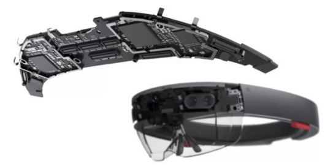

% Mixed Reality mit HoloLens
% Pascal Schulthess
  Lukas Tanner
  Dozent: Tim Weingärtner
% 30. Nov 2016

\pagebreak

# Selbständigkeitserklärung

Hiermit erkläre ich, dass ich die vorliegende Arbeit selbständig angefertigt und keine anderen als
die angegebenen Hilfsmittel verwendet habe. Sämtliche verwendeten Textausschnitte, Zitate oder
Inhalte anderer Verfasser wurden ausdrücklich als solche gekennzeichnet.


Pascal Schulthess (pascal.schulthess@stud.hslu.ch)

---

Lukas Tanner (lukas.tanner@stud.hslu.ch)

---

\pagebreak


# Abstract (deutsch)
HoloLens ist eine mixed reality Brille von Microsoft, die es erlaubt, den Raum mit
holografischen Elementen zu erweitern. Ebenso kann man damit programmatisch mit der Umgebung
interagieren.

Dieses Dokument beschreibt erste Erfahrungen mit dieser neuen Technologie und die Entwicklung
eines Frameworks, das es erlaubt, Informationen zu einem realen Objekt im Raum darstellen zu lassen.

Es wird dargelegt, welche neuen Möglichkeiten sich damit bieten und  wo mögliche Einsatzgebiete sein
können aber auch, wozu sie nicht gebaut wurde. Ebenso werden Schwächen aufgezeigt und die Grenzen
der Technologie beschrieben.

Am Beispiel einer Applikation, mit welcher man dynamische Zusatzinformationen zu realen Geräten
darstellen kann, wird aufgezeigt, wie man zusammen mit der Game Engine Unity Applikationen für die
HoloLens entwickelt.


# Abstract (english)

HoloLens are mixed reality glasses by Microsoft. They can extend the environment with holographic
elements and interact programmatically with the surroundings.

This document describes first steps with this new technology and the developement of a framework
with which you can display additional information to a real life object in the room.

It shows the new possibilities the holographic device provides and in which fields it can be used, but
also for what it wasn't build for. We will show the weaknesses and limitations of the technology
too.

Using the example of an application, with which you can show additional dynamic data about a real world
object, we show how you can develop, in conjonction with the game engine Unity, a holographic
application.


# Abkürzungen und Definitionen

----------------------------------------------------------------------------------------------------
Begriff             Bedeutung
-----------------   ---------------------------------------------------------------
Virtual Reality     Künstliche Welt, in der sich eine Person wie in der realen Welt bewegen kann.
                    Die reale Welt wird komplett mit einer künstlichen ersetzt.

Augmented Reality   Die Realität wird durch zusätzliche virtuelle Elemente angereichert und erhält
                    so einen Mehrwert. Im Gegensatz zur Virtual Reality nimmt man hier die reale
                    Welt immer noch wahr.

Mixed Reality       Wird äquivalent zu "Augmented Reality" verwendet.

Tap                 Gestik, bei welcher der Zeigefinger auf den Daumen tippt. Damit wird eine Aktion
                    ausgelöst (entspricht einem Mausklick).

Press               Gestik, bei welcher ein Tap durchgeführt wird, die Finger jedoch geschlossen
                    bleiben. Damit kann etwas "festgehalten" werden und mit einer Handbewegung ein
                    Objekt manipuliert werden (verschieben, navigieren, scrollen etc.).

Bloom               Gestik, bei welcher sich die fünf Finger einer Hand berühren und nach oben
                    zeigen, um danach die Finger zu spreizen (wie eine Blüte öffnen). Wird als
                    Menü/Windows Taste genutzt.

Gaze                Der Blick, wohin der Benutzer schaut und was die HoloLens dort identifiziert.
                    Das kann sowohl ein reales Objekt sein wie auch ein Hologramm.

Device              Ein Gerät, das technische Informationen zum seinem Zustand über die HoloLens
                    dargestellt haben will

Unity               Unity ist eine Game Engine für 21 verschiedene Plattformen.

Game Engine         Eine Game Engine ist ein Framework für die Erstellung von Videospielen. Es
                    beinhaltet typischerweise Funktionalität für das Rendern von Grafiken,
                    Simulationen für physikalisches Verhalten, Geräusche und Musik, Animationen,
                    künstliche Intelligenz u.v.m.

Shell               Der "Desktop" der HoloLens. Hier können die Applikationen und Hologramme im Raum
                    platziert werden.

Inertiale           Beschleunigungs und Drehratensensoren zur Messung der Trägheitsnavigation
Messeinheit

----------------------------------------------------------------------------------------------------
Table: Definitionen

----------------------------------------------------------------------------------------------------
**Abkürzung**       **Bedeutung**
-----------------   ---------------------------------------------------------------
API                 Application Program Interface, Schnittstelle von Computerprogrammen für
                    Computerprogramme

AR                  Augmented Reality

HL                  HoloLens

ReST                Representational State Transfer, Konzept für APIs über http(s)

TPM                 Trusted Platform Module; Chip, der den Computer um Sicherheitsfunktionen (wie
                    Kryptografie oder Lizenzbestimmungen) erweitert.

VS2015              Visual Studio 2015; Entwicklungsumgebung von Microsoft, u.a.  für .NET
                    Applikationen

----------------------------------------------------------------------------------------------------
Table: Abkürzungen

# Ziele und erwartete Resultate

## Einführung

In den letzten Monaten wurden von vielen Herstellern Virtual Reality Brillen auf den Markt
gebracht, meist im Gaming Bereich. Microsoft hat mit ihrer Mixed Reality Brille ein anderes Zielpublikum
und andere Anwendungsbereiche im Fokus. Mit der HoloLens wird die Umwelt, in welcher sich der Träger
befindet, mit zusätzlichen virtuellen Elementen ergänzt.

Dank Kameras und Sensoren kann die Brille die Umgebung wahrnehmen und Objekte darin erkennen. Somit
können die virtuellen Elemente auf echte Objekte gesetzt werden und damit interagieren.

Die Aufgabenstellung besteht aus vier Teilen:

1. Die Studierenden sollen mit der Microsoft HoloLens Erfahrungen sammeln und ihre Erkenntnisse dokumentieren.
1. Sie sollen die Möglichkeiten und Grenzen anhand von bestehenden Demos und einer eigenen Anwendung aufzeigen.
1. Die Anwendung soll ein eigenes im Rahmen dieser Arbeit realisiertes Framework verwenden.
1. Die Funktionalität des Frameworks und die Anwendung sollen mit dem Auftraggeber definiert werden.

Im Anhang befindet sich das Dokument, in welchem die Aufgabenstellung erhalten wurde unter dem
Namen _Aufgabenstellung PAWI Informatik 2016 Schulthess Tanner.doc_

In diesem Dokument sind die Ergebnisse der Aufgabenstellung dokumentiert und wie folgt strukturiert.

Das Kapitel _Ziele und erwartete Resultate_ enthält die Aufgabenstellung und die Erarbeitung der Anforderungen an das Framework.
Die Kapitel _Mögliche Anwendungsfälle_ und _Mögliche Frameworks_ beinhalten Vorschläge, aus welchen Herrn Weingärtner
eines ausgewählt hat. Darauf folgen die von den Studierenden erstellten Anforderungen an dieses Framework. Zusammen
erfüllen diese Kapitel die Aufgabenstellung Nummer 4.

Das Kapitel _Lösungsentwicklung_ beginnt mit unseren Erfahrungen mit der HoloLens, den vorhandenen
Demos und ihren Grenzen (Aufgabe 1 und 2). Danach kommt die Dokumentation des Frameworks (Aufgabe
3) sowie Tipps und Stolpersteine bei der Entwicklung für die HoloLens (Fortsetzung Aufgabe 1).

Im Abschnitt _Schlussfolgerung und Ausblick_  werden die Grenzen des Projektes und die nächsten
Schritte aufgezeigt. Hier wird beschrieben, welche Themen wir ausgelassen haben und wo in einem
Folgeprojekt weitergearbeitet werden kann.

Abschliessend enthält _Lessons learned_ die persönlichen Erkenntnisse beider Studierenden über die HoloLens sowie
die Projektarbeit und deren Verlauf.

## Mögliche Anwendungsfälle

Die HoloLens bietet sicherlich Einsatzmöglichkeiten im Spielebereich, wie Microsoft mit Games wie
[RoboRaid](https://www.microsoft.com/microsoft-hololens/en-us/apps/roboraid) oder
[Fragments](https://www.microsoft.com/microsoft-hololens/en-us/apps/fragments) bereits gezeigt hat.

Aber sie wurde für Geschäftslösungen entwickelt und dort will sie Microsoft auch positionieren.
Dazu gibt es bereits eine
[Sketchup Adaption](https://www.microsoft.com/en-us/store/p/sketchup-viewer/9nblggh4338q#),
mit welcher mehrere Personen am selben 3D-Modell arbeiten können.

Wir haben folgende Ideen von Anwendungsfällen und möglichen Applikationen

*Brettspiel Simulation
	* Brettspiele haben die Schwächen dass sie sehr statisch sind und sich die Personen an einem Ort treffen müssen. Obwohl es bereits Software Frameworks gibt welche Brettspiele simulieren, ist es nicht optimal mit Maus und Tastatur zu spielen un das Spielbrett auf einem Monitor zu sehen. Die Hololens würde es ermöglichen Brettspiele sehr gut zu simulieren.
* Zusatzinformationen zu realen Objekten darstellen
	* Viele technische Geräte haben Statuswerte welche nur über einen Computer ausgelesen werden können. Die Hololens kann es ermöglichen diese Werte zu sehen. Beispielsweise wäre es für Servicetechniker nützlich zu wissen welche Flüssigkeitsbehälter eines Gerätes leer sind und wo sich dieser Behälter am Gerät befindet.
	Das darstellen von Zusatzinformationen ist jedoch nicht auf technische Geräte beschränkt und könnte auch in Museen verwendet werden.
* Mit einem Smartphone koppeln
    * Da die Hololens bereits über ein Mikrofon und Lautsprecher verfügt, wäre es nützlich Anrufe anzunehmen und benachrichtigungen als Hologramme zu sehen.
* Virtueller Desktop
	* Die Startumgebung (Shell) der Hololens ermöglicht es mehrere 2D Applikation zu starten und plazieren. Jedoch fehlen viele Komfortfunktionen welche wir uns von PC Desktops gewohnt sind. So können Applikationen nicht minimiert werden und es gibt kein Equivalent zur Taskbar.

## Mögliche Frameworks

Ein weiteres Ziel des Projektes ist die Entwicklung eines Frameworks, auf welchem andere
Applikationen aufbauen können. Dazu haben wir uns folgende Gedanken gemacht.

### Raumunabhängiges speichern

Falls eine Applikation einen Status hat, welcher abgespeichert werden soll, hat dies bei 
holografischen Apps zusätzliche Schwierigkeiten im Vergleich zu klassischen Softwareapplikationen.
Der Raum in welchem die holografische Applikation verwendet wird beeinflusst den verfügbaren Platz
und die Anordnung der Hologramme.

Das Framework würde es erlauben für eine Applikation bestimmte Bereiche zu definieren welche vom 
Benutzer im Raum gesetzt werden. So befindet sich z.B. im ersten Raum der Hauptarbeitsbereich auf einem 
Pult und in einem zweiten Raum an einer Wand. Die gesetzten Bereiche könnten gespeichert werden und das 
Framework würde den aktuellen Raum beim Start scannen und falls dieser Wiedererkannt wird die Bereiche 
plazieren.

Das Konzept der Bereiche würde es erlauben dass zwei Personen in unterschiedlichen Räumen zusammen arbeiten 
können, falls die Inhalte der Bereiche über das Internet synchronisiert werden.

Mögliche Anwendungsfälle wären eine Virtuelle Desktopumgebung und Spiele.

### Geräteinformationen darstellen

Technische Geräte zeigen Informationen über ihren Zustand, wie Füllstände,
Geschwindigkeiten, Temperaturen, Druck, Leistung etc. oft über Displays, LEDs oder Webinterfaces an.
Oft werden diese Informationen nicht dort dargestellt, wo sie herkommen. Hier kann

Die HoloLens erkennt ein Gerät und holt sich Informationen zu diesem Gerät ab, das sie dann in der
Nähe des Geräts darstellt. Die Informationen können dynamisch sein, wie  oder auch statische wie Spezifikationen
oder Anleitungen.

Damit wäre es denkbar, dass ganze Vorgänge Schritt für Schritt beschrieben werden. Dabei könnte die
HoloLens auf dem Gerät die Teile hervorheben, die gerade bearbeitet werden müssen (z.B. "Um die
Abdeckung zu entfernen, lösen sie die beleuchteten vier Schrauben mit einem Kreuz-Schraubenzieher").

Eine weitere Anwendung dieses Frameworks wäre, die Informationen, die bei einem Smartphone im
Notification Menu vorhanden sind, mit der HoloLens über dem Smartphone schweben zu lassen.

### Automatische Positionierung von Hologrammen im Raum

Die HoloLens kann einen Raum scannen und Flächen erkennen. Ein mögliches Framework verteilt eine
Menge von Hologrammen an diese Flächen und speichert die Zuordnung. Dies könnte in Applikationen
verwendet werden, welche viele Informationen zeitgleich darstellen sollen.

Ein konkreter Anwendungsfall, dessen Idee zu diesem Framework geführt hat, ist das Darstellen von
Vocabulary "Kärtchen". Ein weiterer Anwendungsfall wäre es in einem Workshop Ideen als Hologramme
aufzuschreiben. Dies würde dem meist zu begrenzten Platz von Whiteboards abhelfen. Hologramme haben
den Vorteil, dass sie Zusatzinformationen, wie z.B. Verbindungen, darstellen können.

## Anforderungen

Nachdem die möglichen Anwendungsfälle und Demonstrationen zusammengetragen waren, wurden diese Herrn
Weingärtner präsentiert. Herr Weingärtner entschied sich für das Framework Geräteinformationen
darstellen. Die Demonstration soll ein Objekt mit Zusatzinformationen darstellen. Als Objekt wurde
von uns ein generischer Laptop gewählt. Zusätzlich wurde uns gegen Ende des Projektes ein 3D-Modell
einer Kaffeemaschine, welche in der HSLU benutzt wird, zu Verfügung gestellt. Die folgenden
Anforderungen wurden von den Studierenden erstellt und von Herr Weingärtner am 17. November
akzeptiert.

### Framework (muss)

Dies sind die Anforderungen an das Framework, die zwingend erfüllt werden müssen, im Überblick

* Erkennen und Lesen QR-Code
    * Gerätetyp (mandatory)
    * Geräteid (mandatory)
    * Verbindungsinformationen (IP) (mandatory)
    * statische Zusatzinformationen zum Gerät (optional beliebige Anzahl)
* Falls definiert, Darstellen eines 3-D-Modells des Gerätetyps
    * Modell lokal gespeichert
* Minimalste Webschnittstelle für Geräteinformationen
    * Gibt Demoinformationen zurück
    * Wird von uns über eine DotNet WebApi Applikation in einem IIS >7 realisiert
* Ansprechen der Webschnittstelle über die HoloLens
* Darstellen der erhaltenen Informationen (Text) im Raum, verbunden mit dem entsprechenden Objekt
    * Die Informationen sollen regelmässig abgefragt und entsprechend aktualisiert werden
* Darstellen eines Bildes (analog Text Information)
    * Bild lokal gespeichert

#### Darstellen der Informationen

Der Hauptnutzen des Frameworks ist das Darstellen von zusätzlichen Informationen zu einzelnen Teilen
des Geräts. Diese Informationen müssen im Raum dargestellt und eine visuelle Verbindung zwischen dem
Text und dem Gerät erstellt werden. Der Ort der Information und wohin sie zeigt ist Teil der Daten,
die die HoloLens über die externe Datenschnittstelle erhält.

#### Webschnittstelle für Geräteinformationen

Die Zusatzinformationen, die die HoloLens darstellen soll, sollen dynamisch sein können. Das heisst,
dass sie über die Zeit ändern können, wie Füllstände oder Drehzahlen. Diese Informationen können
nicht von der HoloLens selber gemessen oder berechnet werden. Sie müssen vom Gerät selber oder von
einer dritten Stelle kommen.  Wir haben uns dabei für eine Webschnittstelle entschieden, die JSON
zurück gibt. Eine Webschnittstelle kann Informationen zurückgeben, die statisch oder das
Ergebnis von komplexen Berechnungen sind; die Schnittstelle kann lokal (vom Gerät selber oder im
Intranet) oder auch über das Internet angeboten werden;

Für die Demonstration des Frameworks entwickeln wir eine Webapplikation, die Pseudodaten für die
dargestellten Geräte generiert. Dabei setzen wir auch Zufallselemente ein um dynamische
Datenänderungen zu simulieren. Es wird auch sichergestellt, dass verschiedene Geräte
unterschiedliche Daten erhalten. Dies wird über unterschiedliche Werte im letzten Segment
(`deviceId`) der URL erreicht.

`http://localhost/HoloApi/api/{int:deviceId}`

Dazu soll für jedes Device Informationen über mehrerer Bestandteile zurückgegeben werden. Das heisst,
die Schnittstelle soll eine Liste mit Datensätzen generieren und nicht nur einen einzelnen.


#### Ansprechen der Webschnittstelle über die HoloLens

Das Framework soll diese Schnittstelle ansprechen und dabei für jedes Gerät eine andere URL (in der
Demoapplikation ist nur das letzte Segment unterschiedlich) aufrufen. Die erhaltenen Daten sollen
dann an der entsprechenden Stelle positioniert werden. Wo genau das sein soll ist Bestandteil des
erhaltenen Datensatz.

Die Schnittstelle soll regelmässig aufgerufen werden und die Daten im Hologramm aktualisiert werden.
<!--TODO: wie oft?-->

#### Erkennen und Lesen QR-Code

Die Informationen, die initial benötigt werden, um ein neues Gerät zu instanziieren, wird in einem
QR-Code gespeichert. Darin sind folgende Informationen untergebracht.

> **Gerätetyp**

> **Geräte ID** Eine Identifikationsnummer, mit welcher das Modell in der Applikation hinterlegt
  ist. Damit weiss die HoloLens, welches Hologramm (Prefab) sie darstellen muss.

> **Verbindungsinformationen** Hier wird die URL angegeben, wo die Informationen abgeholt werden
  können, die zum Gerät dargestellt werden sollen.

> **Zusatzinformationen** optional; zusätzliche statische Informationen, die für das Gerät wichtig
  sind.

Diese Informationen werden in einen Semikolon-getrennten String codiert. Die Zusatzinformationen
können in jedem beliebigen Format sein, dessen Interpretation ist dann Sache des Prefabs selber.

Ein Beispiel:

`type;id;https://localhost/HoloApi/api/2;key1:value1|key2:value3`


Dieser Code muss von der HoloLens erkannt und gelesen werden können.

#### Darstellen eines 3-D-Modells

Das reale Objekt soll mit einem Hologramm ergänzt werden. Damit können wichtige Teile des Geräts
hervorgehoben oder je nach Wert in einer anderen Farbe eingefärbt werden. Es wäre denkbar, dass ein
Elektromotor je nach Temperatur mit einer Farbe von Blau bis Rot eingefärbt wird.

### Framework (kann)

Dazu haben wir noch einige Anforderungen definiert, die wir umsetzen können, wenn die Zeit dazu
reicht oder der Aufwand nicht gross ist.

* Darstellen eines Benutzerhandbuchs (pdf, analog Text Information)
    * pdf lokal gespeichert
* Ein-/Ausblenden von Informationen mittels holografischem Menu
* Es kann entschieden werden, ob die Informationen am realen Gerät oder am Hologramm dargestellt
  werden

#### Benutzerhandbuch darstellen

Neben kurzen dynamischen Informationen ist es oft auch nützlich, längere Texte darstellen können.
Dabei kann es sich um Beschreibungen von Bauteilen handeln, um Anleitungen, wie mit einer Maschine
umgegangen werden soll oder wie einzelne Werte interpretiert und darauf reagiert werden soll.

Dazu soll die Applikation ein Dokument darstellen können. Da dieses Dokument auch länger als ein
Duzend Zeilen sein kann, muss gescrollt werden können. Aus Einfachheit wird das pdf lokal auf der
HoloLens abgelegt.

#### Informationen ein- und ausblenden

Wenn zuviele Informationen über ein Gerät dargestellt werden, kann man den Überblick verlieren und
die wichtigen Daten übersehen. Dazu kommt, dass nicht in jeder Situation die selben Informationen
wichtig sind. So sind im Normalbetrieb möglicherweise die Füllstände interessant, unter Volllast
eher die Drehzahlen und Temperaturen.

Daher ist es praktisch, wenn der Benutzer entscheiden kann, welche Informationen er zu sehen bekommt
und welche er nicht benötigt.

Dazu soll es ein Menu geben, das eine Liste der möglichen Informationen darstellt. Daraus kann
der Benutzer diejenigen Einträge auswählen, die er dargestellt haben möchte. Sobald ein Eintrag aus
dem Menu ausgewählt wird, soll er aus der List verschwinden.  So hat der Benutzer immer die
Übersicht, welche Zusatzinformationen noch nicht dargestellt werden.
Wenn die Liste leer wird (also alle verfügbaren Informationen dargestellt werden), soll das Menu
verschwinden.

Es muss auch möglich sein, dargestellte Informationsfenster wieder zu schliesse. Sollte das Menu
zu diesem Zeitpunkt leer sein, muss es natürlich wieder dargestellt werden. Jedes Fenster, das
geschlossen wird, muss wieder im Menu auftauchen.


\pagebreak

# Lösungsentwicklung

Hier werden die Erfahrungen und die Schritte beschrieben, die während des Projektes gemacht wurden.

## Spezifikation der HoloLens

Die HoloLens besteht aus folgendermassen zusammengestellt

> **Prozessoren**

* Intel 32-bit Architektur mit TPM 2.0
* von Microsoft speziell entwickelte Holographic Processing Unit (HPU) 1.0

> **Memory**

* 64 GB Flash
* 2 GB RAM



> **Optik**

* Transparente holografische Linsen mit Wellenleiter
* 2 HD 16:9 Lichtmaschinen
* automatische Kalibrierung anhand des Abstands zu den Pupillen
* Holografische Auflösung: 2.3 M Lichtpunkte
* Holografische Dichte: > 2.5 k Lichtpunkte pro Radiant


> **Sensoren**

* IMU (Inertiale Messeinheit)
* 4 umgebungsbewusste Kameras
* 1 Tiefenkamera
* 1 2MP Foto / HD Video Kamera
* Mixed Reality Capture (Bilder der Umgebung inklusive der Hologramme)
* 4 Mikrofone
* 1 Umgebungslichtssensor

> **Menschliches Verständnis**

* Raumklang
* Tracking der Blickrichtung
* Gestenerkennung
* Spracherkennung


> **Input / Output / Schnittstellen**

* 2 Lautsprecher
* Audio 3.5mm jack
* WiFi 802.11ac
* Micro USB 2.0
* Bluetooth 4.1 LE

> **Energieversorgung**

* Akkulaufzeit
    * 2 bis 3 Stunden Arbeitszeit
    * bis zu 2 Wochen Standby
    * Laden über die Micro USB Schnittstelle
* Passivkühlung (HL läuft geräuschlos)


## Erste Schritte

Die HoloLens ist als Stand-alone Gerät konzipiert. Sie benötigt keine externen Geräte um zu
funktionieren. Das heisst, die Applikationen werden direkt in der Brille ausgeführt und die
Hologramme werden auch von der Brille selber gerendert.
Die Vorteile davon sind:

* Keine zusätzlichen Kosten für weitere Geräte.
* Keine Abhängigkeiten und Inkompatibilitäten (PCs, Treiber, Grafikkarten etc.).
* Keine Kabel die von der Brille hängen.

Es gibt auch Nachteile:

* Die Brille wiegt schwer nach ein paar Stunden, weil sowohl Rechner, Display als auch Batterie drin
untergebracht sind.
* Die Laufzeit ist limitiert durch die Batterie.
* Die Displays, auf welchen die Hologramme angezeigt werden können, sind sehr klein.

Die ersten Schritte als Anwender mit der HoloLens waren erstaunlich einfach und intuitiv. Beim
ersten Verwenden gibt es ein Tutorial, das dem Träger erklärt, wie mit dem neuen Interface
interagiert wird. Als Pointer gibt es im Zentrum des Sichtfeldes einen Punkt, Gaze genannt. Mit
diesem Pointer zielt man auf die Objekte, mit welchen man interagieren will.

Als Eingabegerät dient die Hand. Sie erkennt drei Gesten. Einerseits kann man das Start Menü
aufrufen, indem man die fünf Finger nach oben zusammenhält und danach öffnet wie eine Blume.
Andererseits gibt es den bekannten Klickevent. Für diesen hält man den Zeigefinger wie ermahnend vor
das Gesicht. Der Cursor im Blickfeld ändert daraufhin sein Aussehen, um dem Benutzer zu
signalisieren, dass der Finger erkannt wurde. Nun kann der Träger mit dem Zeigefinger auf den Daumen
tippen, um einen Klick auszulösen.

Lässt man den Zeigefinger und den Daumen nach dem Tippen zusammen, kann man Hologramme
festhalten. Damit kann man je nach Kontext das Hologramm im Raum verschieben oder durch einen langen
Text scrollen.

Dies funktioniert sehr gut und recht intuitiv, solange man sich auf den Cursor konzentriert. Der
verändert sich im Aussehen, je nachdem, mit was die Blickrichtung kollidiert und ob der
Zeigefinger für den Klick erkannt wurde.

Der Cursor bewegt sich anhand der HoloLens, also so wie sich auch der Kopf bewegt. Dies ist dann
problematisch, wenn man den Cursor etwas weiter entfernt oder sehr genau platzieren will. Jede
kleinste Bewegung des Kopfs resultiert in einer Verschiebung des Cursors. Vor allem beim Benutzen
der holografischen Tastatur kann dies ein Problem sein. Eine deutliche Verbesserung für eine
nächste Version der HL wäre unserer Meinung nach, wenn sich der Cursor nach dem Blick richten würde,
also nach den Augen und nicht nur dem Kopf.

Die Tap-Gestik kann bei längerer Arbeit ermüdend auf Hand und Arm wirken. Abhilfe schaffen können
hier folgende Erweiterungen:

- Für Texteingabe kann eine Bluetooth-Tastatur angehängt werden.
- Die meisten Schaltflächen können auch über Sprachkommandos angesprochen werden.
- Im Lieferumfang der HL ist ein Clicker enthalten, der den selben Event auslöst wie der Tap.

Die Hauptanforderung der HoloLens wurde grossartig umgesetzt, die Verschmelzung der realen und der
virtuellen Welt  ist Microsoft  sehr gut gelungen. Auch wenn sich viele Hologramme im Sichtfeld befinden
ist die Orientierung im realen Raum immer gut. Es gibt kaum Verwechslungen zwischen der
virtuellen und realen Welt. Die Auflösung der Hologramme ist gut, dennoch besteht nie die Gefahr,
dass ein Hologramm als ein reales Objekt oder ein reales Objekt für ein Hologramm gehalten wird.
Die bewusste Aufmerksamkeit des Benutzers liegt hauptsächlich auf den Hologrammen, die unbewusste
Aufmerksamkeit im realen Raum. So kann er sich natürlich im Zimmer bewegen und dennoch fokussiert
mit den Hologrammen interagieren.

Leider sind die Displays, auf welchen die Hologramme dargestellt werden können, klein. Es wird fast
nur das zentrale Gesichtsfeld abgedeckt. Man kann die Aufmerksamkeit des Benutzers nicht über
Bewegungen, die im peripheren Gesichtsfeld passieren auf einen anderen Bereich im Zimmer
lenken. Dies muss zum Beispiel über Raumklang oder andere visuelle Hinweise (wie ein Pfeil, der zum
entsprechenden Ort zeigt) gelöst werden. Obwohl dies eher eine Anforderung  bei Spielen ist, so
lassen sich auch Anwendungsfälle bei Business Applikationen finden. So ist es denkbar, dass ein
Hologramm eine längere Zeit auf eine Berechnung oder auf die Antwort eines Netzwerkzugriffs warten
muss und sich der Benutzer derweil auf einen anderen Bereich im Raum konzentriert. Hier wäre es
praktisch, wenn der Benutzer informiert würde, sobald das Hologramm wieder bereit ist.

Die kleinen Displays sind auch problematisch wenn man sich eine Übersicht verschaffen will.
Grosse Hologramme werden an den Rändern der Displays abgeschnitten und das nimmt man wahr. Der
Benutzer muss den Kopf bewegen, wenn er mehr sehen will.

Eine andere Limitation ist die Distanz zur HoloLens, in welcher Hologramme projiziert werden. Sie
werden nur etwa eine Armlänge vor dem Gesicht noch dargestellt. Geht man näher hin, verschwinden
sie. Dies ist deshalb problematisch weil das Hologramm genau in diesem Bereich  verschwindet, wo wir
Menschen gewöhnt sind zu arbeiten. Wenn wir mit Objekten hantieren sind wir uns gewohnt, dies
innerhalb eines halben Meters vor dem Kopf zu tun. Aber genau dort ist kann die HoloLens nichts
darstellen. Dies zwingt den Benutzer dazu, mit den Hologrammen in einer grösseren Distanz zu
interagieren, was mindestens gewöhnungsbedürftig ist.

Die HoloLens wurde für den Gebrauch in Gebäuden entwickelt und eignet sich nicht, um sich damit
draussen zu bewegen. Sie ist mit 579 Gramm ziemlich schwer und schränkt damit die
Bewegungsfreiheit etwas ein. Aber lang nicht so stark wie man es vermuten könnte, wenn man die
Dimensionen sieht. Sie ist nicht so starr wie sie auf den ersten Blick wirkt und schmiegt sich
erstaunlich bequem an den Kopf und sitzt so stabil, dass auch schnelle und ruckartige horizontale
Bewegungen mit dem Kopf möglich sind.

Auch das Rendering der Farben bei Bewegungen ist noch verbesserungswürdig. Bei schnellen Bewegungen
mit dem Kopf werden nicht alle Farben gleich schnell aktualisiert und die drei Schichten werden
leicht verschoben angezeigt. Dies lässt sich am besten demonstrieren, wenn man den weissen Default
Cursor anschaut und sich dabei um die eigene Y-Achse dreht. Der weisse Cursor teilt sich dabei in
drei Punkte (Blau, Grün, Rot), die in einer horizontalen Linie sichtbar werden.

### Demoapplikationen

Um eine Applikation starten zu können, geht man, wie unter Windows üblich, ins Startmenü. In der
HoloLens öffnet  man es mittels der Bloom-Geste. Es gibt z.B. den unter Windows 8 eingeführten
App-Store den Webbrowser Edge, die Systemsteuerungen, eine Bibliothek für Hologramme.
Dies sind alles Applikationen, die in einem Fenster laufen und nicht die ganze Umgebung einnehmen.

Die Fenster selber sind nicht flach wie auf einem Desktop, sondern haben eine Tiefe von ca. 2 cm.
Der Benutzer kann nun diese Fenster irgendwo im Raum platzieren. Dazu greift er sich das Fenster
mittels der Press-Geste und kann es nun im Raum verschieben und zwar in allen drei Richtungen des
Raums. Er muss nur darauf achten, dass die Hand nicht aus dem Wahrnehmungsbereich der HL kommt.

Die HoloLens versucht dabei das Fenster an den realen Begebenheiten auszurichten. Mit anderen Worten,
wenn das Fenster in die Nähe einer Wand kommt, richtet es sich automatisch so aus, dass
es wie ein Bild an der Wand hängt.

#### Hologramme

Auf der HoloLens gibt es eine Bibliothek mit vorgefertigten Hologrammen, die der Benutzer im Raum
platzieren kann. Dies ist ein guter Einstiegspunkt, um das Konzept der Hologramme und deren
Platzierung im Raum kennen zu lernen.


#### RoboRaid

RoboRaid ist ein Spiel, bei welchem der Spieler Angriffe von Robotern abwehren muss. Es spielt im
Zimmer, in welchem sich der Spieler befindet.

Bevor das Spiel zum ersten Mal startet wird der Spieler aufgefordert, seine Umgebung, sprich den
Raum, in welchem er sich befindet, zu scannen. Dazu muss er mit der HoloLens die Wände anschauen,
bis der Applikation klar ist, wo sie sich befinden. Danach kann das Spiel auch schon beginnen.

Als Erstes wird der Spieler von einem schwebenden Roboter informiert, dass man Angriffe von
feindlichen Robotern abwehren muss. Dazu muss man sie mit dem Cursor anvisieren und mittels
Tap-Geste abschiessen.

Die feindlichen Roboter kommen aus einer Landungsbrücke eines Raumschiffes, welche durch die Wand
des Raumes bricht und sich mittels dreier Arme festkrallt. Wenn man daneben schiesst, reisst man
ebenfalls Löcher in die Wand. Dies sind tolle Beispiele, wie man die reale Welt mit der
holografischen verschmelzt. Auch wenn man den Hologrammen anmerkt, dass sie künstlich sind und dass
die Wand nicht wirklich beschädigt ist, so sind die Effekte dennoch beeindruckend und der Spieler
findet sich in einer Zwischenwelt wieder.


Die Angriffe laufen in verschiedenen Wellen ab. Nachdem man alle Roboter aus einer Landungsbrücke
zerstört hat, bricht eine nächste Landungsbrücke an einem anderen Ort im Raum durch die Wand und
die Angriffe gehen weiter.

Da die Displays das periphere Gesichtsfeld nicht abdecken, ist es nicht möglich, die nächste Welle
aus den Augenwinkeln wahrzunehmen und seinen Körper danach auszurichten. Die Entwickler lösten
dieses Problem, indem sie dem Spieler einen Pfeil darstellen, der in die Richtung des nächsten
Gegners zeigt.

Es gibt zwei Sorten von Robotern, die den Spieler angreifen: Einerseits gibt es diejenigen, die
im Raum schweben und andererseits diejenigen, die über die Wände krabbeln und sich auch hinter den Wänden
verstecken können. Um sie auch hinter der Wand erreichen zu können, kann der Spieler mittels
Sprachkommando den Röntgenblick aktivieren. Damit kann man eine begrenzte Zeit hinter die Wände
schauen. Danach dauert es eine Weile bis die Fähigkeit wieder vorhanden ist.

Die Roboter schiessen natürlich zurück. Der Spieler wehrt diese Angriffe ab, indem er den Schüssen
ausweicht. Dies geschieht, indem er sich im Raum bewegt. Dies führt dazu, dass der Spieler
rasche Ausfallschritte nach rechts oder links macht oder sich urplötzlich duckt. Im Verlauf des
Spiels gibt es immer mehr Roboter, die gleichzeitig auf den Spieler schiessen. Dann kann der
Spieler durch die Ausweichmanöver auch mal ausser Atem geraten.

Hier zeigen sich jedoch die Probleme, die sich ergeben, da der Fokus an die Blickrichtung der
HoloLens und nicht die der Augen gebunden ist. In der Hitze des Gefechts und mit vielen Robotern und
Schüssen im Blickfeld verliert man den Cursor oft aus den Augen. Und der zielt dann am Roboter
vorbei.

Es ist auch vorgekommen, dass wir mit dem Finger für den Tap gezielt hatten, statt mit dem Kopf.

<!--TODO: Fazit
Story mode zu kurz, Continous mode wird langweilig
-->

#### Jenga

Bei Jenga werden 54 Holzblöcke, die dreimal so lang wie breit sind, aufeinander geschichtet, so dass
ein Turm mit quadratischer Grundfläche entsteht. Die einzelnen Schichten bestehen dabei aus je drei
Blöcken, die kreuzweise geschichtet werden. Ziel ist es, einzelne Blöcke aus dem Turm zu nehmen und
sie oben auf den Turm zu legen, ohne dass dieser einstürzt.

Jenga wurde für die HoloLens adaptiert und kann über den Windows Store installiert werden.

Dieses Spiel ist ein gutes Beispiel, wo die Limitationen der HoloLens und ihrer Hologramme liegen.
Man kann die Blöcke relativ einfach fassen und bewegen, aber es gibt kein haptisches Feedback. Bei
der realen Version gibt es bei den Blöcken  minimale Abweichungen in den Dimensionen, so dass der
Spieler testen kann, ob sich ein Block einfach bewegen lässt oder nicht. Er merkt auch, wenn er den
Block schräg bewegt, da sich der Block verkantet und deshalb schwerer zu bewegen ist. Zudem kann der
Spieler auch zwei Hände benutzen, was vor allem beim Zurücklegen auf den Turm hilft.

All dies funktioniert  bei der HoloLens nicht. Man kann den Block nicht antippen, um zu sehen, ob er sich
bewegt. Wenn man versucht,  ihn schräg aus dem Turm zu ziehen, merkt man es meist erst, wenn der
Turm schon gefährlich wackelt. Und es ist oft nicht ersichtlich, in welche Richtung man korrigieren
muss. Es ist grundsätzlich gewöhnungsbedürftig, Hologramme festzuhalten und zu verschieben wegen der
fehlenden Haptik.

#### Fragments

Fragments ist ein Mystery Game für die HoloLens. Man schlüpft in die Rolle eines Detektivs, der
Hinweise sammeln muss um einem Kindsentführer auf die Schliche zu kommen. Die Entwickler haben hier
sämtliche Möglichkeiten der HoloLens ausgelotet, die möglich sind:

- Interaktion mit holografischen Personen
    - adaptieren ihr Verhalten anhand der Ausrichtung des Spielers im Raum
- Anpassung des Spielfelds an die reale Umgebung
    - holografische Personen passen sich der Umgebung an
- Raumklang
- Gestensteuerung
- Sprachsteuerung

Auch in diesem Spiel wird man zuerst aufgefordert, die Umgebung zu scannen, damit die Applikation
weiss, wo sie die Hologramme platzieren muss, damit der Spieler damit interagieren kann. Das gewählte
Zimmer war zuerst zu klein, also mussten wir noch Teile des Flurs dazu nehmen. Das führte z.B. dazu, dass
die Karte im Zimmer am Schrank hing, man aber für die Interaktion mit dem Terminal in den Flur gehen
musste. Dieses Bewusstsein der Applikation über die räumlichen Begebenheiten ist beeindruckend.

Der Spieler wird Teil eines Ermittlerteams, das beauftragt wird, ein entführtes Kind zu finden und
einen Mord aufzuklären. Dabei wird er an verschiedene Schauplätze geführt um Hinweisen nachzugehen.
Hier ziehen die Entwickler alle Register. Es geht darum, sich einen Überblick über die Situation zu
verschaffen, also einen Schritt zurück zu machen und von weitem zu schauen. Dann muss man aber auch
Teile der Szenerie genauer anschauen und sogar Objekte aufheben, um sie zu untersuchen.

Es gibt auch Situationen, bei denen man sich auf sein Gehör verlassen und einem Geräusch
folgen muss. Wenn man die Quelle dann gefunden hat, muss man es identifizieren. Das sind grandiose
Beispiele, wie realistisch die beiden kleinen Lautsprecher über den Ohren die Illusion erzeugen
können, der Ton käme von einem entfernten Ort im Raum.


Die gewonnenen Erkenntnisse können dann in einem Terminal eingegeben und Schlussfolgerungen
gezogen werden, die das Gebiet, wo man suchen muss, eingrenzen. Dabei helfen die anderen Mitglieder
des Ermittlerteams. Das sind lebensgrosse Figuren, die mit dem Spieler sprechen und auf sein
Verhalten reagieren. So weisen sie z.B. den Spieler darauf hin, dass er zur Seite gehen soll,
wenn er  einer Figur im Weg steht oder setzen sich sogar mal auf das Sofa des Spielers, um mit ihm zu
plaudern.

Es ist ein ganz neues Spielerlebnis, wenn man sich mit gleichgrossen Non-Player Characters in einer
Umgebung, die man aus dem täglichen Leben kennt, auseinander setzt. Da schaut man auch gerne über
die noch hölzernen Bewegungen und die kaum vorhandene Mimik hinweg.

Ein weiteres Problem kann das reale Licht im Raum darstellen. Wenn die realen Lichtverhältnisse nicht
den in der Virtualität vorgesehenen entsprechen, kann es dazu führen, dass man wichtige Details nur
sehr schwer sieht. Es kann vorkommen, dass die Lampe im Raum blendet oder das Hologramm für dunkle
Verhältnisse zu hell und deshalb zu transparent dargestellt wird.

Wenn der Raum zu verwinkelt ist oder die Wände keine regelmässigen Oberflächen haben, hat auch die
HoloLens Mühe mit der Raumaufteilung. Ein Teil des Spielfelds war mal teilweise in einem Schrank und
in der Wand, so dass die Interaktion mit den Hologrammen sehr schwierig war.


#### HoloTube

HoloTube ist eine inoffizielle YouTube-App für die HoloLens. Man kann damit auf YouTube Videos
suchen und abspielen.  Sie unterstützt auch die so genannten spherical videos oder 360°-Videos.
Die Auflösung dieser Videos ist aber sehr schlecht. Dazu kommt, dass sich hier der Umstand, dass man die
reale Umgebung sieht, nachteilig auswirkt. Gerade bei Videos möchte man ja von der Umwelt nichts
mehr wahrnehmen. Auch die Helligkeit des Raums wirkt sich negativ auf das Erlebnis aus.

Normale Videos werden in einem eigenen Fenster abgespielt. Hier ist die Qualität so wie man sie
erwarten kann und die Transparenz wirkt hier weniger störend. Dieser Player kann in zwei
verschiedenen Modi verwendet werden, "Locked" und "Follow me". Bei ersterem bleibt das Fenster dort,
wo man es platziert hat, beim zweiten bleibt es vor den Augen des Benutzers, egal wohin er den Kopf
bewegt.


### Tutorials

Microsoft stellt viele [Tutorials](https://developer.microsoft.com/en-us/windows/holographic/academy)
zur Verfügung, die es dem Entwickler erleichtern sollen, den Einstieg in die neue Denke der HoloLens
zu erleichtern. Obwohl es Microsoft offen gelassen hat, wie die Hologramme erstellt werden, so
haben sie sich bei den Tutorials auf [Unity](https://unity3d.com/) konzentriert.

Man kann die Applikationen entweder auf eine HoloLens installieren oder man lässt sie in einem
Emulator laufen. Dazu muss aber die Virtualisierung vom Prozessor unterstützt werden.

Als Einsteiger gilt es, sich mit folgenden Themen auseinander zu setzen:

* **Blickrichtung:** Damit wird der Cursor in der HoloLens bewegt
* **Gesten:** Das Erkennen von Bewegungen mit der Hand und darauf reagieren
* **Stimme:** Man kann der HoloLens die Befehle auch mittels Stimme übergeben
* **Raumklang:** Die HoloLens hat zwei kleine Lautsprecher, die sich über den Ohren befinden. Dank
geschickter Modulation der Töne kann der Eindruck erzeugt werden, dass die Geräusche von irgendwo
im Raum her kommen.
* **Raumerkennung:** Die HoloLens kann den Raum, in welchem sie sich befindet, wahrnehmen und auch
die Tiefe erkennen. Dieses Scannen geschieht automatisch, jedoch kann der Entwickler mit diesen
Informationen arbeiten und darauf reagieren.

## Entwicklung für die HoloLens

Die [Universal Windows Platform]
(https://developer.microsoft.com/en-us/windows/apps/getstarted) ist die generische Plattform um
Applikationen auf verschiedensten Geräten zu entwickeln. Darunter fallen Desktop, Server, Web,
Game, IoT sowie HoloLens Applikationen für Windows 10. Alle UWP Applikationen können auf die
HoloLens portiert werden. Diese werden jedoch in 2D Fenster als "normale" Apps gestartet. Die
[Windows Holographic APIs](https://developer.microsoft.com/en-us/windows/holographic/documentation) 
ermöglichen es holografische Apps zu erstellen. Microsoft empfiehlt es, mit Unity und VisualStudio zu
arbeiten. Es ist auch möglich, eigene Engines mit 
[DirectX](https://developer.microsoft.com/en-us/windows/holographic/directx_development_overview) 
und C++/C# zu erstellen.

### Unity
Unity 3D wurde bekannt als eine Engine für die Spiele-Entwicklung. Mit dem Aufkommen von Applikationen für
die Virtuelle und Erweiterte Realität wird sie mittlerweile auch für industrielle Applikationen verwendet.

Die Entwicklung mit der Unity Engine hat einige Unterschiede zur klassichen Programmierung. Objekte werden
in der Welt plaziert und Skripte ihnen angehängt. Diese Scripte können in C# oder in Javascript geschrieben sein.


Der Editor ist in die folgenden Bereiche unterteilt:

1) Scene / Game / Asset Store
Der zentrale Bereich wird zur Entwicklungszeit für das Scene Fenster benutzt. Dieses enthält die 2D oder 3D Welt
der aktuellen Scene. Objekte können selektiert, fokussiert und verändert werden. Unsichtbare Objekte wie Kameras
und Lichtquellen werden als Symbole dargestellt.
Oberhalb des Fensters gibt es Buttons, um in den Play Mode zu wechseln. Der Play Mode wird das Fenster Game aktivieren
und das Programm gestartet.
Die letzte Option im zentralen Bereich ist der Asset Store. Er ermöglicht es Modelle, Texturen und weitere Assets zu
suchen, zu kaufen und herunterzuladen.

2) Hierarchy
Der linke Bereich enthält das Hierarchy Fenster mit allen Objekten der aktuellen Szene. Die Objekte
sind hierarchisch angeordnet. Sie können mit dem Create Button erstellt, per Drag and Drop verschoben
und gelöscht werden. Im Play Mode zeigt Hierarchy den dynamischen Status der Scene und es können
Änderungen ausprobiert werden. Diese Änderungen verschwinden jedoch wieder, nachdem der Play Mode
verlassen wird. Ein Doppelklick auf ein Objekt fokussiert dieses im Scene Fenster.

3) Inspector
Die Werte von selektierten Objekten und Einstellungen können im rechten Bereich, dem Inspector, angesehen
und verändert werden. Bei Objekten werden nebst den Transform Einstellungen (Position, Rotation und Skallierung)
die spezifischen Skripte mit ihren Parametern dargestellt. Neue Skripte werden per AddComponent oder Drag
and Drop hinzugefügt.

4) Project / Console
Unten bei Unity befindet sich entweder das Project oder das Console Fenster. Während der Entwicklung wird
meist das Project Fenster benutzt, es stellt die verfügbaren Assets wie z.B. 3D-Modelle dar.
Im Play Mode ist das Console Fenster nützlicher, es listet Fehler sowie Debug Meldungen.

### VisualStudio

Unity ermöglicht es ein Visual Studio Projekt zu generieren. Fast alle notwendigen Konfigurationen des
VS Projektes können bereits im Unity gesetzt werden. Das VisualStudio wird verwendet, um die
C# Skripte zu editieren und um das Programm auf die HoloLens oder den Emulator zu laden.

## Entwicklung "Gerätestatus" Framework

Für die Demonstration des Frameworks haben wir uns für einen Laptop als Gerät entschieden. Der ist
mobil und kann ebenfalls als Webserver dienen. Somit ist kein dediziertes Demogerät und zusätzliche
Infrastruktur notwendig.

Für die Darstellung der Informationen werden folgende Daten benötigt, die wir über die
Webschnittstelle und QR-Code erhalten werden.

- Textinformation, die dargestellt werden soll
- Bezeichner der Quelle
- Vektor für die relative Position der Information zum Gerät
- Vektor für die relative Position der Quelle zum Gerät

### Workflow

Ein Gerät, das sich einmalig mit zusätzlichen Informationen bei der HoloLens anmelden muss. Dies
geschieht über einen QR-Code, der mit der Applikation auf der HoloLens gescannt werden muss. Mit den
Informationen konfiguriert die HoloLens das Gerät, indem es sich merkt, wo es steht und wo es die
zusätzlichen Daten abholen kann.

Wenn sich die Daten dynamisch ändern können (wie Füllstand oder Temperatur oder Ähnliches),
holt sich die HoloLens periodisch die aktualisierten Daten und stellt sie erneut dar. Wenn es sich
um statische Daten handelt, fällt dies natürlich weg.

### Aufbau des Frameworks
Das Framework besteht aus einem UnityPackage und einer Anleitung, wie die einzelnen Komponenten
genutzt werden sollen. Zusätzlich wird das Microsoft HoloToolkit UnityPackage benötigt. Dieses ist
[auf GitHub verfügbar](https://github.com/Microsoft/HoloToolkit-Unity) und enthält ein Readme
mit der Installationsanleitung.


#### Die Assets

Als Assets werden alle Dateien bezeichnet, welche in einer Unity App benutzt werden.

- **3D-Modelle:** Unity-Objekte mit Meshes, Positionierung, Collider und Materialien.
- **Scripts:** C# Klassen, welche Unity-Objekten angehängt werden können (Javascript ist auch möglich).
- **Materialien:** Oberfläche, welche mittels Texturen und Shader auf 3D-Modelle angewendet wird.
- **Prefabs:** Eine Gruppierung von Assets, welche zur Laufzeit instanziert werden kann.
- Weiter gibt es Bilder, Sprites, Audio, Lichtquellen, Physikmaterialien und Animationen.

Im erstellten Framework befinden sich hauptsächlich Scripts und Prefabs.

**DeviceManager.cs**
Der `DeviceManager` behandelt die Erstellung und das Entfernen von Geräten.

**DeviceBehavior.cs**
Jedes Gerät wird durch das `DeviceBehavior` Script gesteuert. Es enthält alle offline
Informationen zum Gerät und die URL zur Webschnittstelle. In regelmässigen Abständen,
konfigurierbar durch `PollRateInSec` werden die Informationen abgefragt und dargestellt.

**Device Prefab**
Für jedes neue Gerät muss ein Device Prefab erstellt werden. Es enthält das 3D-Modell, den
Collider und das `DeviceBehavior` Skript mit der gewünschten Konfiguration aus
`DeviceName`, `DeviceInformationUrl` und `PollRateInSec`. Weiter müssen die `TextInformationPrefab` und
`ImageInformationPrefab` sowie die Materialien (Normal und Selektiert) für die 3D-Linien gesetzt werden.

**InformationBaseScript.cs**
Um Informationen wie Text oder Bild sinnvoll darzustellen, wird dynamisch eine "3D-Linie" von
einem Ort des Gerätes (Anker) zum Ort, an welchem die Information dargestellt wird (Ziel), erzeugt.
Diese "3D-Linie" besteht aus einer Kugel beim Anker, einem langen Zylinder als Verbindung und
einem breiten Zylinder als Podest für die Information. Es ermöglicht die Information mit der
Press-Gestik zu verschieben und wechselt das Material der "3D-Linie", falls die Information fokussiert wird.

**TextInformationScript.cs**
Diese Ableitung des `InformationBaseScript` ermöglicht es, Text mittels `SetText` darzustellen.


**TextInformation Prefab**
Damit der Benutzer den Text sehen kann, sind in diesem Prefab nebst dem `TextInformation` Scripts
mehrere Assets nötig. Ein Billboard Script, aus dem HoloToolkit, richtet das Objekt relativ zum Blickwinkel der Kamera aus.

Ein `BoxCollider` wird verwendet, damit registriert werden kann, ob der Benutzer das Objekt
fokussiert. Der Collider passt sich mittels dem `InformationBaseScript` dem Inhalt des Prefabs an.
Auch die Unity Scripts `HorizontalLayerGroup` und `ContentSizeFitter` werden benötigt, damit sich die
Grösse dynamisch dem Inhalt anpasst. Hierarchisch enthält das Prefab die Unity UI Objekte Canvas,
Panel und Text. Das Panel besitzt ein Image Script ohne Bild aber mit der Farbe blau, um einen
Hintergrund für den Text zu haben. Ein Padding im  `HorizontalLayerGroup` des Panels erleichtert die
Lesbarkeit des Textes. Auf der untersten Ebene befindet sich das Textobjekt,  welches vom
`TextInformation` Script aktualisiert wird.


**ImageInformationScript.cs**
Vergleichbar mit dem `TextInformation` Script wird stattdessen ein Bild durch `SetImage` gesetzt.
Zusätzlich wird die Grösse des Prefabs der Grösse des Bildes angepasst. Dies war nötig, da der
`ContentSizeFitter` nicht wie bei dem Textobjekt funktioniert hat.

**ImageInformation Prefab**
Dieses Prefab gleicht dem `TextInformation` Prefab bis auf zwei Änderungen. Der `ContentSizeFitter`
wird nicht verwendet und es wird das Text Objekt mit `RawImage` ersetzt.


**InformationSelectionScript.cs**
Die verschiedenen Informationen werden zu Beginn nicht dargestellt. Erst in einem Menü erscheint
jede Information als Button. Wird der Button geklickt, verschwindet er und die Information wird
dargestellt. Falls alle Informationen dargestellt werden, verschwindet das Menü. Informationen, auf
welche geklickt werden, verschwinden und der Button im Menü erscheint erneut.
Das Script benötigt ein `PrefabButton` und das `PanelTransform` um die Buttons dynamisch zu
erstellen und zu positionieren. Die Methode `DeviceToEnable` registriert eine Information, welche
momentan Disabled ist. Sobald ein Button gedrückt wird, wird er entfernt und das Event
`EnableDevice` ausgelöst. `DeviceBehavior` ruft `DeviceToEnable` auf und behandelt `EnableDevice`.

**InformationSelection Prefab**
Dem `TextInformation` Prefab sehr ähnlich, unterscheidet sich dieses nur durch die `VerticalLayerGroup` und den vordefinierten Text. Auf der Layer Group sind die Abstände zwischen den generierten Buttons und zu dem Rand definiert.


#### Konfiguration
Die oben genannten Assets müssen in einer Unity Scene konfiguriert werden. Die minimale Hierarchie
besteht aus den folgenden Assets:

- MainCamera
    - ManualCameraControl (Script)
- Managers
    - GazeManager (Script)
    - GestureManager (Script)
    - DeviceManager (Script)
    - KeywordManager (Script)
- EventSystem
- Cursor
    - CursorManager (Script)
    - CursorOnHolograms
    - CursorOffHolograms
- DirectionalLight
- SpatialMapping
    - SpatialMappingObserver (Script)
    - SpatialMappingManager (Script)
    - ObjectSurfaceObserver (Script)

**MainCamera**
Unter `HoloToolkit/Utilities/Prefabs/Main Camera.prefab` befindet sich die hololens-kompatible
Kamera. Um im Unity Editor die Kamera zu steuern, gibt es das Script
`HoloToolkit/Utilities/Scripts/ManualCameraControl.cs`.

**Managers**
Das mittels `CreateEmpty` erstellte Gameobjekt wird benutzt, um generelle Manager Skripte anzuhängen.
Der `HoloToolkit/Input/Scripts/GazeManager.cs` steuert die Gaze Gestik, welche zum Fokussieren von
Objekten benutzt wird. Mit `StabilizationPlane` und `GazeStabilization` wird der Gaze, äquivalent zur
Maus auf einem PC, stabilisiert. Dies ist nützlich, da eine Maus auf dem Tisch stabiler ist als
die Kopfbewegungen eines Menschen.
Mittels des `HoloToolkit/Input/Scripts/GestureManagers.cs` werden die Meldungen `OnSelect`, `OnPressed`
und `OnReleased` an fokussierte Objekte gesendet. Falls das fokussierte Objekt eine dieser Methoden
implementiert hat, wird sie ausgeführt. Zusätzlich bietet der Manager verschiedene Events bezüglich
Manipulation, z.B. `ManipulationStartet`, und Properties wie das `FocusedObject` an.

Um die Spracherkennung zu nutzen, wurde ein `HoloToolkit/Input/Scripts/KeywordManager.cs` kreiert.
Das Property `KeywordsAndResponses` beinhaltet gesprochene Worte (Keyword) und den dazugehörigen
Methodenaufruf auf ein Gameobjekt. Als Beispiel wird bei "remove all" die Methode `RemoveDevices()`
auf dem `DeviceManager` Script ausgeführt. Das Keyword sollte aus mehr als einem Wort bestehen und
anderen Keywords nicht zu sehr gleichen. Dies erhöht die Chance, dass die HoloLens den richtigen
Befehl erkennt.

**EventSystem**
Ein `EventSystem` wird benötigt, falls man mit Unity-UI Elementen arbeitet. Nebst dem normalen
`StandaloneInputModule` enthält das Holo Toolkit ein `HoloLensInputModule`.

**Cursor**
Das `HoloToolkit/Input/Prefab/Cursor.prefab` ist die Darstellung des Cursors. Es können zwei
verschiedene Modelle angegeben werden. Ein normales Modell und eines für den Fall, dass etwas
fokussiert ist. Zudem kann eine Distanz zwischen Fokussierungspunkt und Cursor konfiguriert
werden. Falls es einen `GazeManager` gibt, in unserem Fall im Managers Objekt, wird der Cursor
automatisch positioniert.

**DirectionalLight**
Das `DirectionalLight` von Unity ist nicht nötig, lässt die Hologramme aber natürlicher aussehen. Es
können auch andere Lichtquellen benutzt werden, da jedoch die Umgebung, in welcher die HoloLens
eingesetzt wird, nicht bekannt ist, empfehlen wir eine weit entfernte Lichtquelle.

**SpacialMapping**
Damit die Umgebung wahrgenommen werden kann, wird das
`HoloToolkit/SpatialMapping/Prefabs/SpatialMapping.prefab` genutzt. Mit dem `SpatialMappingObserver`
kann die Auflösung und Aktualisierungszeit konfiguriert werden. Der `SpatialMappingManager` kann die
Umrisse der Strukturen darstellen. Dies wird in der Demo Applikation nicht genutzt, da es vom
Gerät ablenken würde.

#### Neues Gerät hinzufügen

Nachdem man das Framework eingerichtet hat, kann man die Geräte definieren. Dazu importiert man das
3D-Objekt in Unity, indem die gewünschte Datai in das Projekt/Assets Fenster gezogen wird.
Das Hauptobjekt muss alle Skalierungs- und Rotationswerte auf 0 gesetzt haben. Falls das
3D-Modell nicht in der gewünschten Grösse oder Ausrichtung vorhanden ist, muss es in einem Kindobjekt des
Prefab angepasst werden.

Das Hauptobjekt benötigt einen `BoxCollider`, welcher das gesamte Objekt umfasst. Der Eckpunkt mit den
kleinsten X; Y- und Z-Werten bildet den Ursprung für die Koordinaten der Informationen.

Mit dem `DeviceBehavior` Script werden alle nötigen Funktionalitäten dem Modell hinzugefügt. Für alle
Geräte sind die Prefabs `Textinformation`, `ImageInformation`, `InformationSelection` sowie die Materialien
`ConnectionMaterial` und `ConnectionWhenSelected` nötig. Spezifisch für das Modell sind der Name, die URL,
von welcher die `TextInformationen` kommen, die Abfragerate sowie die `ImageInformationen`. Statt über die
Webschnittstelle werden die Bilder im Unity konfiguriert. Nebst dem Bild als Textur werden äquivalente
Informationen wie bei `TextInformation` benötigt.

Um das Modell am realen Objekt ausrichten zu können, müssen zwei Punkte zur Kalibrierung definiert
werden. Die Koordinaten dieser Punkte müssen beim `DeviceBehavior` als `Top Right Calibration` und
`Bottom Left Calibration` erfasst werden. Um dem Benutzer die Kalibrierung zu erleichtern, ist es
ratsam, die entsprechenden Punkte auf dem realen Gerät auch zu markieren.

Das sich nun in der Hierarchy befindende GameObject muss als Prefab gespeichert werden. Im Project
Fenster unter den Assets Ordner führe Rechtsklick > Create > Prefab aus. Das GameObject muss als
Nächstes auf das neu erstellte Prefab gezogen werden. Das GameObject im Hierarchy Fenster wird nicht
mehr benötigt.

Der `DeviceManager` benötigt dieses Prefab und ein Name um es zu instanzieren. Der `KeywordManager` kann
mit einem neuen Keyword ergänzt werden, welches `DeviceManager.CreateDevice(string name)` mit dem
entsprechenden Namen aufruft.

Dies sind alle benötigten Schritte in Unity, um ein neues Gerät hinzuzufügen. Was noch fehlt ist die
Konfiguration oder Implementation einer Webschnittstelle und der Textinformationen. Das Kapitel Datenquelle
 beschreibt die Daten und ihre Struktur.

### QR-Code

Der QR-Code ist sozusagen der Einstiegspunkt für die Applikation. Darauf ist die ID des Geräts und
die Datenquelle vermerkt, wo sich die Applikation die Informationen für das entsprechende Gerät
abholen kann.

Diese Informationen würden dann verwendet, um das entsprechende Hologramm im Raum zu platzieren und
die Informationen an das Objekt zu heften und regelmässig zu aktualisieren.

Um Bilder mit der Kamera der  HoloLens aufzunehmen, gibt es das `PhotoCapture` Objekt im Namespace
`UnityEngine.VR.WSA.WebCam`.

Für die Erkennung und das Decodieren des QR-Codes haben wir uns für die
ZXing [^zxing-library] Bibliothek entschieden. Sie unterstützt sehr viele Formate und es gibt sie
für viele Plattformen.

Der Prozess um mit der HoloLens Kamera ein Bild aufzunehmen ist ein vierstufiger, der bei den
einzelnen Schritten jeweils mit Callback-Functions arbeitet.

```cs
public class QrCam : MonoBehaviour
{
    private PhotoCapture _photoCapture;
    private int _height;
    private int _width;

    public void Start()
    {
        InvokeRepeating("InitCamera", 5, 3f);
    }

    public void InitCamera()
    {
        PhotoCapture.CreateAsync(false, OnPhotoCaptureCreated);
    }
```

Zuerst wird die Kamera asynchron initialisiert und den Callback mitgeben, der aufgerufen wird,
sobald sie bereit ist.

Da wird die Auflösung festgelegt und für die 4 Farbkanäle Blau, Grün, Rot und alpha je 8 Bit
reserviert. Danach wird die Kamera im Modus gestartet, die es erlaubt, Einzelbilder aufzunehmen.
Auch hier wird ein Callback mitgegeben.

```cs
    private void OnPhotoCaptureCreated(PhotoCapture captureobject)
    {
        _photoCapture = captureobject;
        Resolution resolution =
            PhotoCapture.SupportedResolutions
                .OrderByDescending(res => res.width * res.height).First();

        _height = resolution.height;
        _width = resolution.width;

        var parameters = new CameraParameters
        {
            hologramOpacity = 0.0f,
            cameraResolutionHeight = resolution.height,
            cameraResolutionWidth = resolution.width,
            pixelFormat = CapturePixelFormat.BGRA32
        };

        captureobject.StartPhotoModeAsync(parameters, false, OnPhotoModeStarted);
    }
```

Sobald die Kamera bereit ist, wird ein Bild aufgenommen, das dann einem weiteren Callback übergeben
wird.

```cs
    private void OnPhotoModeStarted(PhotoCapture.PhotoCaptureResult result)
    {
        _photoCapture.TakePhotoAsync(OnCapturedToMemory);
    }
```

Dieses Bild wird dann in ein Byte-Array umgewandelt und der QR Library übergeben, um  den QR-Code zu
decodieren.

```cs
    private void OnCapturedToMemory(PhotoCapture.PhotoCaptureResult result,
            PhotoCaptureFrame photocaptureframe)
    {
        var bufferList = new List<byte>();
        photocaptureframe.CopyRawImageDataIntoBuffer(bufferList);

        IBarcodeReader reader = new BarcodeReader();
        Result qrValue =
            reader.Decode(bufferList.ToArray(), _width, _height,
                RGBLuminanceSource.BitmapFormat.BGRA32);
        Debug.Log(qrValue.Text);
    }
}
```

Je nach Version ist die Kapazität auf einem QR-Code sehr limitiert[^qr-capacity].

[^qr-capacity]:[Kapazitäten von QR-Codes](http://www.qrcode.com/en/about/version.html)
[^zxing-library]:[Zebra Crossing Barcode Reader](https://zxingnet.codeplex.com/)

Leider sind wir an der Umsetzung dieses Features gescheitert.

Die Informationen, die wir über den QR-Code erhalten hätten, haben wir nun direkt in den Prefabs der
einzelnen Geräte untergebracht. Das hat den Nachteil, dass bei Änderungen die Applikation neu
kompiliert und auf die HoloLens installiert werden muss und nicht nur ein neuer QR-Code erstellt und
ausgedruckt werden kann.

Wir denken nicht, dass es grundsätzlich unmöglich ist, dieses Feature zu implementieren. Eventuell
muss man die Library selber kompilieren oder sogar den benötigten Source Code in das Projekt
kopieren. Im nächsten Kapitel wird beschrieben, wieso wir es dennoch nicht geschafft haben.

#### Gründe für das Scheitern

Der erste Versuch scheiterte an falschen Annahmen, wie das Teilprojekt aufgebaut sein soll. Der
Teil, der QR-Codes liest und eine externe Datenquelle anspricht, benötigt keine virtuellen Elemente.
Er sollte nur die Kamera ansprechen und auf den erhaltenen  Bildern mittels einer Bibliothek nach einem
QR-Code suchen. Wie die gefundenen Informationen an den Teil der Applikation, der für das
Rendering des Hologramms und der Informationen zuständig ist, gesendet werden, wollten wir in einem
späteren Schritt lösen.

So versuchten wir eine Applikation zu entwickeln, die komplett ohne Unity auskommt und nur Bilder
von der Kamera vom  QR-Framework verarbeiten lässt. Das dies möglich sein sollte, entnahmen wir der
Tatsache, dass es im Visual Studio 2015 ein Projekttemplate für holografische Applikationen gibt.
Diese Applikation wurde aber nie lauffähig auf der HoloLens.

<!--TODO: Pasci weiss vielleicht wieso-->

Als Nächstes versuchten wir, die Funktionalität in einem Unity Projekt unterzubringen. Wir fügten
dem Workspace ein Script hinzu und editierten es im VS2015. Um die ZXing Referenz hinzuzufügen
gingen wir erst so vor, wie wir es von klassischen .NET-Projekten kannten. Leider fand der
Unity Editor diese Assemblies, die über `add reference` oder NuGet hinzugefügt wurden, nicht.
Damit konnte man das Projekt nicht mehr kompilieren.

Damit der  Unity Editor fremde Assemblies findet und sie in den Build-Pfad aufnimmt, müssen sie im
`Assets`-Ordner sein. Leider haben wir keine Version gefunden, die so kompiliert wurde, dass sie mit
Unity kompatibel wäre. Dies obwohl auf ihrer Seite
[die Unterstützung von Unity 3d](https://zxingnet.codeplex.com/) aufgelistet ist.

Wir haben alle [verfügbaren Libraries](https://zxingnet.codeplex.com/downloads/get/824664) versucht,
aber keine gefunden, bei welcher Unity keinen Fehler beim Kompilieren geworfen hätte.[^next-steps]

[^next-steps]:Beim Erstellen dieses Dokuments haben wir Informationen gefunden, die die nächsten
Schritte sein könnten, dieses Problem dennoch zu lösen. Einer ist ein weiteres Assembly, das für
Unity geeignet sein könnte, ein anderer den Source Code direkt in das Projekt zu nehmen statt
ein  kompiliertes Assembly.
[Das Assembly ist hier ](https://zxingnet.codeplex.com/downloads/get/824665) zu finden,
[den Source Code hier](https://zxingnet.codeplex.com/downloads/get/824668)


### Datenquelle

Als dynamische Datenquelle haben wir uns für eine ReST-Schnittstelle entschieden[^source]. Sie liefert für
drei verschiedene Geräte unterschiedliche Daten, die so aufgebaut sind.

```json
{
    information":[
    {
        "description":"Static description of the device",
        "text":"Dynamic data about the device",
        "anchor":{
            "x":0.5,
            "y":0.4,
            "z":0
        },
        "target":{
            "x":0.9,
            "y":1,
            "z":0.5
        },
    },
    {
        "description":"Static description of the device",
        "text":"Dynamic data about the device",
        "anchor":{
            "x":0,
            "y":0.1,
            "z":0
        },
        "target":{
            "x":1,
            "y":1.3,
            "z":2.3
        },
    }]
}
```

`information` ist die Liste von Informationen, welche separat dargestellt werden.

`description` ist die Bezeichnung des Teils des überwachten Geräts, z.B. "Einschaltknopf",
"Wassertank".

`text` ist die Information, an der man interessiert ist. Hier kann der Füllstand,
Fehlermeldungen etc. stehen.

`anchor` ist die relative Position zum Ort am Gerät selber. Zwischen den beiden
Positionen gibt es eine logische Verbindung, die visuell dargestellt wird.

`target` ist die relative Position, wo die Information dargestellt werden soll.

Die Positionen sind relativ zum Eckpunkt rechts hinten unten in Meter. X ist die Distanz nach
rechts, Y nach oben und Z nach vorne.

[^source]:[Source on GitHub](https://github.com/ledux/pawi-hololens-dummyapi.git)

### Funktionsumfang und Abgleich zu den Anforderungen

**Framework**
Das Geräteinformation Framework implementiert die Pflichtanforderungen mit der Ausnahme des QR-Codes.
Die Problematik mit dem QR-Code wurde oben detailliert erläutert.  Mehrere 3D-Modelle von Geräten
können dargestellt und platziert werden. ???wie plaziert????????????????????????????????
Textinformationen werden von einer Webschnittstelle periodisch gelesen und dargestellt. Bildinformationen,
welche sich lokal in der Applikation befinden, werden dargestellt. Alle Informationen richten sich zur
HoloLens aus und sind im Raum verschiebbar. Das Sprachkommando `Remove All` entfernt alle dargestellten
Geräte.

Von den zusätzlichen Anforderungen wurde nur eine Implementiert. Einzelne Informationen können mit einem
Menü aktiviert und deaktiviert werden. Das Menü enthält Buttons für alle deaktivierten Informationen.
Ein Tap auf das Gerät selbst de/aktiviert das Menü, ansonsten deaktiviert sich das Menü selbst, sobald
alle Informationen deaktiviert sind.

Das Darstellen eines PDF-Benutzerhandbuchs konnte nicht implementiert werden. Die HoloLens erlaubt es nicht,
andere Apps in einer holografischen App darzustellen. Dadurch wäre eine eigene PDF Viewer Implementation
notwendig. Das Benutzerhandbuch könnte als Workaround in einzelne Bilder aufgeteilt werden. Diese Bilder
könnten als Bildinformation dargestellt werden. Durch das Selektionsmenü wäre es möglich, nur einzelne
"Seiten" zu sehen. Besser wäre, eine neue Art der Informationsdarstellung, welche es erlaubt, zwischen mehreren
Bildern zu wechseln. Diese wäre eine Kombination aus dem Selektionsmenü und der Bildinformation.

Aus zeitlichen Gründen wurde die letzte Anforderung, das Switchen der Darstellung der Informationen
zwischen Hologramm und Gerät, nicht implementiert. Die Informationen werden immer am Hologramm dargestellt.
Die Anforderung ist abhängig von der Positionierung. Wie bereits erwähnt war die Positionierung mit vielen
Komplikationen verbunden und wurde erst sehr spät umgesetzt. Die Infrastruktur für dieses Feature ist jedoch
zu grossen Teilen vorhanden. Der `BoxCollider` des Geräte Objektes muss zum realen Gerät verschoben werden.
Die Informationen positionieren sich relativ dazu.

??????????????????webschnittstelle: framework oder demo????????????????????????????

**Demo**

Die Demo hat zwei Geräte konfiguriert, einen [Laptop](http://tf3dm.com/search/?q=electronics+laptop+umbrella&search=Search)
und eine [Kaffemaschine](https://www.cgtrader.com/3d-models/furniture/kitchen/coffee-maker-nespresso-aguila).
Der Laptop stellt die folgenden Informationen dar: ?????????????????????????????????

* Textinformation
    * Einschaltknopf
    * CPU Auslastung
    * IP
    * Zeit
* Bildinformation
    * Manual??????????????????

Die Kaffemaschine ??????????????????????
* TextInformation
    * Einschaltknopf
    * Füllstand
* Bildinformation
    * Logo
    * ?????????

## Tipps und Stolpersteine bei der Entwicklung

Während der Entwicklung sind wir auf einige Probleme gestossen, welche wir in diesem Abschnitt
zusammen mit den allfälligen Lösungen auflisten.

### Setup der Entwicklungsumgebung

Um für die HoloLens zu entwickeln wird ein Windows 10 Pro, Enterprise oder Education Computer mit
aktiviertem Hyper-V benötigt. Das SDK unterstützt offiziell auch die Betriebssysteme ab Windows 7,
jedoch nicht alle benötigten Tools.

[Installationsanleitung](https://developer.microsoft.com/en-us/windows/holographic/install_the_tools)

### Einschränkungen des HoloLens Betriebssystems

Obwohl die HoloLens selbst ein Computer ist, bietet das WindowsHolographic nicht die gewohnten
Funktionalitäten. Es gibt keine CommandLine, keinen TaskManager und auch keinen Windows Explorer.
Apps,  welche man auf dem Desktop (genannt Shell) platziert hat, sind gestartet. Um den Prozess zu beenden,
muss das Icon, welches 2D oder 3D sein kann, entfernt werden.

### HoloLens auf sich Anpassen

Mit einem Gewicht von immerhin 579 Gramm ist die HoloLens nicht gerade leicht. Wenn man sich aber
etwas Zeit nimmt, um die HoloLens an den eigenen Kopf anzupassen, ist dennoch ein grosser
Tragekomfort gewährleistet. Dazu gehört die Wahl des geeigneteren der beiden Stegstützen, auf
welchen die HoloLens auf der Nase getragen wird und der Verwendung des Overhead Straps.

### Einrichten der HoloLens für die Entwicklung

Um mit den Entwicklungstools auf die HoloLens zugreifen zu können, muss der Debug Mode aktiviert
werden. Microsoft hat die Anleitung dazu auf der Seite
[Using Visual Studio](https://developer.microsoft.com/en-us/windows/holographic/Using_Visual_Studio.html#enabling_developer_mode)
versteckt. Die IP-Adresse der HoloLens kann man über `Settings->Network&Internet->Advanced options` auslesen.

### Konfiguration eines neuen Projektes

Ein Projekt mit Unity muss spezifisch für die HoloLens angepasst werden. Das Tutorial
[Microsoft Holograms 100](https://developer.microsoft.com/en-us/windows/holographic/holograms_100)
enthält die nötigen Konfigurationen. Der Unity Editor ermöglicht es, vieles ausserhalb der HoloLens
und dessen Emulators zu testen. Viele der Skripte wie `ManualCameraControl`, `GestureManager` und
`KeywordManager` bieten die Möglichkeit, einen alternativen Input per Tastatur zu definieren.

### Holographic Academy

In neun Tutorials werden die wichtigsten Elemente für die Entwicklung beigebracht.
[Microsoft Holographic Academy](https://developer.microsoft.com/en-us/windows/holographic/academy)

### Weiss und Schwarz

Die Farben Weiss und Schwarz haben jeweils ihre eigenen Probleme. Da die HoloLens nur additiv RGB
Farben darstellen kann, ist Schwarz transparent. Dadurch kann man nicht beeinflussen, was der Benutzer
sieht. Im Gegensatz dazu hat Weiss das Problem, dass die HoloLens RGB in 3 separaten Schichten darstellt
und diese nicht immer perfekt übereinander liegen und teilweise schwache Farbverläufe entstehen.
Dadurch sieht man z.B. bei einem weit entfernten weissen Punkt stattdessen drei leicht versetzte
Punkte in rot, grün und blau.

### Update Methode nicht blockieren

Jedes von `MonoBehaviour` abgeleitete Script, was nötig ist um ein Script einem Unity Objekt anzuhängen, besitzt
eine Update Methode. Diese Update Methode wird pro Frame einmal aufgerufen und ist somit nur für nicht blockierende
Aufgaben geeignet. Häufig wird diese benutzt, um das dazugehörige Objekt neu zu positionieren und damit eine
Bewegung darzustellen. Dabei muss berücksichtigt werden, dass die Update Methode mit verschiedenen Frameraten
unterschiedlich häufig aufgerufen wird. Lange dauernde Befehle in dieser Methode beeinflussen die Framerate,
und sollten asynchron aufgerufen werden. Coroutinen ermöglichen es, eine Methode zu starten, welche pro Frame
einen Teil ihrer Funktionalität ausführt und danach pausiert.

```cs
void Update()
{
    if (Input.GetKeyDown("f"))
    {
        StartCoroutine("Fade");
    }
}

IEnumerator Fade()
{
    for (float f = 1f; f >= 0; f -= 0.1f)
    {
        Color c = renderer.material.color;
        c.a = f;
        renderer.material.color = c;
        yield return null;
    }
}
```

Wenn Update aufgerufen wird, startet die Coroutine Fade und läuft durch bis zum ersten yield
return. Im folgenden Frame fährt die Ausführung in der Methode nach dem yield weiter. Das yield
Konzept von C# ermöglicht es, Methoden teilweise ausführen zu lassen. Beim ersten Aufruf einer
Yield Methode wird sie bis zum ersten yield return aufgerufen und gibt den Rückgabewert zurück,
dieser muss nicht null sein. Der Status aller Variablen der Methode wird beibehalten und beim
nächsten Aufruf wird die Ausführung nach dem zuletzt genutzten yield return fortgesetzt. Es können
mehrere yield return Statements verwendet werden.
Weitere Informationen zum Beispiel findet man in der
[Unity Dokumentation](https://docs.unity3d.com/Manual/Coroutines.html).

Eine Coroutine wurde auch im Script `DeviceBehavior` für den asynchronen HTTP Request benutzt.
Der Aufruf `www.Send();` liefert eine `AsyncOperation` zurück, was es dem StartCoroutine
ermöglicht `GetInformationFromUrl` erst dann erneut aufzurufen, wenn die HTTP Antwort erhalten
wurde.

```cs
void UpdateText()
{
    StartCoroutine(GetInformationFromUrl());
}

IEnumerator GetInformationFromUrl()
{
    // Erstellung des HTTP Requests mittels der URL
    UnityWebRequest www = UnityWebRequest.Get(DeviceInformationUrl);
    // Asynchroner Aufruf des Requestes
    yield return www.Send();
    // Behandlung der Antwort
    Debug.Log(www.downloadHandler.text);
}
```

Um zyklische Aufrufe unabhängig von Update durchzuführen, gibt es die Methode InvokeRepeating von MonoBehaviour.
Die Dauer bis zum ersten Aufruf und die Frequenz danach können in Sekunden übergeben werden. Dadurch sind die
Aufrufe unabhängig von der Framerate.

```cs
// Aufruf alle 3 Sekunden nach initialem Warten von 2 Sekunden
void Start ()
{
    InvokeRepeating("DoSomething", 2, 3);
}

void DoSomething()
{
    //xyz
}
```

### JSON Serialisieren
Unity bietet mit der UnityEngine.JsonUtility eine einfache Möglichkeit mit JSON Objekten
umzugehen. Der Aufbau der Daten kann als Klasse oder Struct definiert werden. Falls man Klassen
verwendet, können jedoch Probleme mit hierarchischer Serialisierung auftauchen.

```cs
[System.Serializable]
public struct JsonInput
{
    [System.Serializable]
    public struct JsonInfo
    {
        [System.Serializable]
        public struct JsonVector
        {
            public float x;
            public float y;
            public float z;
        }

        public string descriptor;
        public string text;

        public JsonVector anchor;
        public JsonVector target;
    }

    public JsonInfo[] information;
}
```

Die Serialisierung ist mit einer Zeile möglich.

```cs
var input = JsonUtility.FromJson<JsonInput>(jsonString);
```

### Dynamisch Formen erstellen

Es gibt vordefinierte [primitive Formen](https://docs.unity3d.com/Manual/PrimitiveObjects.html)
wie Würfel und Kugel welche einfach erstellt werden können. Im erstellten Framework bestehen die
Verbindungen aus langen  schmalen Zylindern.

```cs
// Erstellung des GameObjects
var Cylinder = GameObject.CreatePrimitive(PrimitiveType.Cylinder);
// Positionierung relativ zum parent ermöglichen
Cylinder.transform.parent = this.gameObject.gameObject.transform;
// Position setzen
Cylinder.transform.position = new Vector3(2f, 1f, 4f);
// Grösse verändern
Cylinder.transform.localScale = new Vector3(50f, 5f, 50f);
// Das Material setzen
Cylinder.GetComponent<Renderer>().material = SomeMaterial;
//

//Das Objekt muss selbst wieder zerstört werden
void OnDestroy()
{
    Destroy(Cylinder);
}
```

### Hierarchie beachten

Jedes GameObject befindet sich in einer Hierarchie. Mit der Methode `.transform.SetParent()` kann das Elternobjekt verändert werden. Wird das Elternobjekt positioniert oder verschoben, beeinflusst dies auch die Position der Kinder. Die `transform` Variable jedes GameObjects besitzt die absolute Position `position` sowie auch die lokale Position `localPosition`. Meistens ist es sinnvoll, die Hierarchien zu bilden und mit den lokalen Werten zu arbeiten. Ansonsten werden relative Positionierungen und Bewegungen schnell unübersichtlich und kompliziert.


### Platzierung relativ zur Ecke eines Objektes

Für das Geräteinformation Framework muss es möglich sein, Koordinaten relativ zur Ecke eines Gerätes zu definieren. Da jedes Gerät einen `BoxCollider` besitzen muss, wird dessen Ecke als Ursprung benutzt. Die Variable `size` besitzt die Durchmesser des Collider pro Dimension. Da diese Werte unabhängig von der lokalen Skallierung sind, müssen sie skalliert werden. Als letzter Schritt werden alle Werte im Vektor halbiert.
```cs
boxColliderSize.Scale(Device.transform.localScale);
boxColliderSize = boxColliderSize / 2;
```
Es gibt eine weitere Möglichkeit, die Grösse eines Collider, Renderer oder Mesh auszulesen. Mit der 'bounds' Variable erhält man Zugriff auf das Zentrum, die Grösse und weitere Werte. Diese Werte sind relativ zum Koordinatensystem der Welt, somit verändert sich die Breite eines Objektes durch die Rotation. Im Framework war jedoch die Distanz im lokalen Koordinatensystem gesucht.

### Rotation nach anderem Objekt ausrichten

Um die oben erwähnten Zylinder-Verbindungen zu realisieren, wird der Zylinder zuerst zwischen
Start und Ziel positioniert. Die Rotation des Zylinders kann mit der Methode `LookAt` einfach gesetzt
werden.

```cs
Cylinder.transform.LookAt(connectionSource.transform.position, Vector3.up);
```

### 3D-Modell Dateiformate

Unity kann folgende Formate nativ importieren: `.fbx, .dae, .3ds, .dxf` und `.obj` [^3d-formats].
Maschinenbauer in der Industrie nutzen jedoch andere Dateiformate wie `.step` und `.stl`, da die
exakte Form in ihrem Bereich eine grössere Bedeutung hat als die Texturen und Animationen. Mittels
Konverter, wie dem [Spin 3D Converter Software](http://www.nchsoftware.com/3dconverter/),
können `.stl` in `.obj` konvertiert werden. Das Problem an `.stl` ist jedoch, dass es keine
Materialinformationen beinhaltet.

[^3d-formats]:[Unity 3D Formate](https://docs.unity3d.com/Manual/3D-formats.html)

Selbst Modelle welche nicht für die Industrie erstellt wurden, können Probleme bereiten. Ein
Demoobjekt, eine Kaffemaschine, wurde vom Dozenten zur Verfügung gestellt. Die 2 Formate .obj und
.max sind vorhanden. Das .obj kann von Unity importiert werden, jedoch die dazugehörige .mtl Datei
nicht. Dadurch sind alle Materialien gleichfarbig, siehe ImageInformation Prefab Abbildung. Wir
konnten keinen Konverter finden, welcher .obj zusammen mit .mtl in ein importierbares Format wandeln
kann. Ein Online-Konverter erlaubte .mtl Files, konnte die Grösse der .obj Datei jedoch nicht
verarbeiten. Beim importieren des zweiten Formates .max erschien eine Fehlermeldung, da Unity
3D-Studio Max nicht auf dem Rechner finden konnte. Da es ein proprietäres Format ist, wird die
Konvertierung an das proprietäre Programm übergeben. Somit ist von der Kaffemaschine nur das 3D-Modell
ohne Farben in der Demo des Frameworks. Die einzelnen Materialien müssten manuell eingefärbt werden
oder jemand mit einem 3D-Studio Max konvertiert da .max in ein .fbx.

### Shader auf der HoloLens

Jedes Material benötigt einen Shader, welcher spezifiziert, wie die Oberfläche in verschiedenen
Situationen berechnet wird.
Damit ein Shader auch auf der HoloLens funktioniert, muss er in Unity unter
`Edit/Project Settings/Graphics/Always Included Shaders` aufgeführt werden. Nicht funktionierende
Shader werden Pink dargestellt.

### Probleme mit 2D Linien

Mit dem `LineRenderer` können 2D Linien in der 3D Umgebung dargestellt werden. Vielen Materialien
haben Probleme, die Linie zu färben. Der `Particles/Additive Shader` funktioniert, ist jedoch nicht
deckend. Die Linie hat eine definierte Breite und richtet sich nach der Kamera aus. Falls sie mehr als
zwei Punkte verbindet, ist diese Breite im  dreidimensionalen Raum und aus der Sicht der Kamera nicht
mehr konstant. Statt 2D Linien wird im erstellten Framework mit 3D Zylinder gearbeitet. Dies
vermeidet einen Stilbruch zwischen 2D und 3D.

```cs
LineRenderer lineRenderer = gameObject.AddComponent<LineRenderer>();
lineRenderer.SetColors(Color.red, Color.red);
lineRenderer.material = new Material(Shader.Find("Particles/Additive"));
lineRenderer.SetWidth(0.01f, 0.01f);

// Eckpunkte setzen
// GetLineCorners erzeugt die Koordinaten
Vector3[] linePoints = this.GetLineCorners();
lineRenderer.SetVertexCount(linePoints.Length);
lineRenderer.SetPositions(linePoints);
```

### Spline Bewegung

Falls ein Objekt einer stetigen Linie folgen soll, gibt es ein Spline Controller Skript von
der [Unity Community](http://wiki.unity3d.com/index.php/Main_Page). Dieses Skript wurde
ausprobiert, wird jedoch im Framework und in der Demo App nicht verwendet. Kind Objekte eines
GameObjects geben die Fixpunkte an, welche besucht werden.

### Raycast

Ein Raycast erkennt die erste Kollision von einem Punkt und einer Richtung aus. Ein Beispiel dazu
ist die Gaze Gestik. Von der Kamera aus wird ein Raycast gesendet und liefert das Objekt und die
Position. Es ist möglich, ein bestimmtes Objekt als Ziel zu wählen. Im nachfolgenden Beispiel
möchte man herausfinden, ob sich das Objekt über einem bestimmten anderen Zielobjekt befindet.

```cs
// Raycast nach unten
var rayOrigin = new Ray(transform.position, Vector3.down);
RaycastHit hit;
// True wenn der Raycast den targetCollider innerhalb von
// der Distanz 2 trifft.
if (targetCollider.Raycast(rayOrigin, out hit, 2f))
{
    var position = hit.point;
}
```

### Manipulations Gestik

Das Verschieben von Objekten kann wie folgt gelöst werden. Beim `OnPressed` Methodenaufruf wird die
aktuelle Position gespeichert und ein Flag gesetzt. Die `OnReleased` Methode wird nicht benötigt, da
der Benutzer sehr wahrscheinlich das Objekt nicht mehr fokussiert hat, wenn er die Gestik beendet.
Stattdessen wird das Flag bei den Events `ManipulationCanceled` und `ManipulationCompleted`
zurückgesetzt. Dies ist unabhängig davon wie die Gestik beendet wird.

```cs
private bool isPressed = false;
private Vector3 previousPosition;

void Start()
{
    GestureManager.Instance.ManipulationCanceled += this.ResetIsPressed;
    GestureManager.Instance.ManipulationCompleted += this.ResetIsPressed;
}

private void ResetIsPressed()
{
    this.isPressed = false;
}

void OnPressed()
{
    this.previousPosition = this.gameObject.transform.position;
    this.isPressed = true;
}

void Update()
{
    if (this.isPressed && GestureManager.Instance.ManipulationInProgress)
    {
        this.gameObject.transform.position = this.previousPosition + GestureManager.Instance.ManipulationOffset;
    }
}

void OnDestroy()
{
    GestureManager.Instance.ManipulationCanceled -= this.ResetIsPressed;
    GestureManager.Instance.ManipulationCompleted -= this.ResetIsPressed;
}
```

### 3rd Party Libraries

Um in einem Unity Projekt bereits kompilierte Libraries (sprich .dll) zu verwenden, müssen die DLLs
in den Ordner `Assets/Plugins` kopiert werden. Der Unity Editor registriert die Änderungen und
kompiliert das Projekt neu.

### Capabilities im VisualStudio setzen
Damit die HoloLens auf bestimmte Funktionen wie SpacialMapping oder das Mikrofon zugreifen darf,
muss dies im Unity (Edit > ProjectSettings > Player > PublishingSettings > Capabilities)
oder im VisualStudio (im Package.appxmanifest) gesetzt werden. Wir empfehlen, es im Unity
Projekt einzustellen, falls jedoch bereits ein VisualStudio Projekt generiert wurde wird die
VS Konfiguration nicht mehr überschrieben, ausser man modifiziert die Datei UnityOverride.txt.


# Schlussfolgerungen und Ausblick

Da diese Arbeit nur ein Prototyp ist und höchstens als Proof of Concept gelten kann, gibt es
einiges, das wir ausgespart haben.

## Sicherheit

Die Informationen, die die HoloLens über die Geräte darstellt, sind potentiell kritisch und dürfen
nicht in jedem Fall frei verfügbar sein. In unserem Szenario haben wir diesen Aspekt vollständig
ausgeklammert. Aber grundsätzlich muss es möglich sein, dass sich die HoloLens an der Datenquelle
identifizieren muss, bevor sie Daten erhält. Hier sind folgende Szenarien möglich:

- Es können die Zugangsdaten im QR-Code selber untergebracht werden. Damit hat aber jeder, der Zugang
zum QR-Code hat, automatisch Zugang zu den Daten.
- Die HoloLens wird bei der Datenquelle registriert und die Zugangsdaten auf der HoloLens selber
installiert (z.B. Benutzername/Passwort oder Zertifikat).
- Fixes Pairing bei Bluetooth.

## Art der Datenquelle

Es ist denkbar, dass auch andere Datenquellen als eine Webschnittstelle zum Einsatz kommen können.
Gerade wenn es sich um technische Geräte handelt (und nicht um z.B Bilder, Skulpturen,
Gebäudeteile) und man sich sowieso in der unmittelbaren Umgebung aufhält, liegt der Einsatz von
Bluetooth auf der Hand.

Diese Art und Weise, wie die Applikation zu den Daten kommt, müsste auch noch im QR-Code
untergebracht werden.

## Update Intervall

Nicht alle dynamischen Informationen müssen gleich oft aktualisiert werden. So reicht es
möglicherweise aus, Füllstände alle paar Minuten abzufragen, während sich Drehzahlen alle paar
Sekunden ändern. Es sind auch Situationen denkbar, wo sich die die Intervalle ändern können. Wenn
sich die Werte einer kritischen Grösse nähern, ist es sinnvoll, wenn öfters aktualisiert wird.

Dazu kann man das Update Intervall als optionales Property `nextUpdate` dem Informationsobjekt
anhängen. Ein einzelnes Objekt, das alle 2 Sekunden aktualisiert werden soll, könnte so aussehen.

```json
{
    "description":"Static description of the device",
    "text":"Dynamic data about the device",
    "nextUpdate":2
    "anchor":{
        "x":0.5,
        "y":0.4,
        "z":0
    },
    "target":{
        "x":0.9,
        "y":1,
        "z":0.5
    },
}
```

## Zustand speichern

Das Framework bietet keine Möglichkeit an, erstellte und platzierte Hologramme zu speichern. Das
heisst, jedes Mal wenn die Applikation gestartet wird, müssen die gewünschten Geräte instanziiert und
platziert werden. Das kann sehr aufwändig und mühsam werden. Es müsste also eine Möglichkeit
geschaffen werden, um den momentanen Zustand im Raum speichern zu können. Dazu gehört mindestens

* Welche Geräte wurden instanziiert
* Wo stehen die Geräte
* Welche Daten werden auf den Geräten dargestellt und welche sind verborgen


## Automatisches Ausrichten der Datenfenster

Zur Zeit ist es die Aufgabe des Programmierers, der ein neues Gerät erstellt und die
Datenschnittstelle zur Verfügung stellt, zu definieren, wo die Daten dargestellt werden sollen. Das
heisst, die Datenfenster sind am Hologramm ausgerichtet, egal welche und wie viel von diesen
dargestellt werden. Das kann dazu führen, dass  die sichtbaren Datenfenster nicht gleichmässig
verteilt dargestellt werden. Eine Erweiterung könnte dafür sorgen, dass sich die sichtbaren
Datenfenster automatisch gegeneinander ausrichten.

Da dies aber zur Folge hat, dass die Fenster an einem anderen Ort dargestellt werden können, als es
der Benutzer erwartet und der Benutzer dadurch verwirrt werden kann, sollte dieses Feature
ausgeschaltet werden können.


_--> Notizen TODO: ausformulieren_

- pdf über schnittstelle zur verfügung stellen, statt lokal

# Lessons learned

## Rückblick Pascal Schulthess

Ein Projekt mit der HoloLens durchführen zu dürfen war eine interessante Möglichkeit, eine andere
Seite der Programmierung kennenzulernen. Das Gerät ist meiner Meinung nach eine revolutionäre Technologie,
welche zwar noch einige Schwächen hat, jedoch in ein paar Generationen überzeugen wird. Sobald das Display
genügend gross ist, ist meiner Meinung nach die grösste Schwäche gelöst.

Das Spiel RoboRaid hat mich und einige Freunde von der Technologie überzeugt. Ich persönlich bin
anfällig auf Motion Sickness bei VR Brillen, hatte jedoch nie auch nur ein Anzeichen davon mit der HoloLens.
Dass die Brille bequem sitzt ist fast eine Kunst für sich selbst, ist aber möglich dank der vielen
Einstellungsmöglichkeiten.

Obwohl ich seit Jahren mit der Programmiersprache C# arbeite, ist die Kombination von Unity und C#
sehr verschieden vom Gewohnten. Ich habe viel über Unity und die Möglichkeiten der HoloLens gelernt.
Der Schritt von sich aufrufenden Klassen/Metoden zu hierarchischen Objekten mit Skripts bedingt
andere Arten von Architekturen. Ich musste realisieren, dass ein Framework in dieser Umgebung weniger
eine eigenständige Klassenbibliothek ist, sondern eine Kombination von verschiedenen Assets mit einer
Anleitung wie diese zusammen mit HoloLens Assets verwendet werden können.

Der Projektablauf war meiner Meinung nach nicht optimal. Die Anfangsphase, in welcher ich die Demos,
Tutorials und eigene Tests durchgegangen bin, verlief gut und ich lernte vieles. Ich hatte bald eine Idee
für ein Framework (raumunabhängiges Speichern) und eine Demo (simples Miniaturenspiel) und begann Bereiche
daraus auszuprobieren. Wir hätten möglichst früh alle unsere Frameworkideen auflisten und auf Herr
Weingärtner zugehen sollen. So hätten wir früher bemerkt, dass er eine andere Frameworkidee bevorzugt. Nach
der Entscheidung des Frameworkes hätten wir direkt die Anforderungen zusammen mit Herr Weingärtner erarbeiten
sollen. Wir erstellten die Anforderungen erst später und ohne Dialog mit ihm. Die Anforderungen wurden zwar
von ihm akzeptiert, jedoch fühlte sich die danach folgende Implementierung nicht an, als hätten wir einen
konkreten "Kunden". Dadurch war die Motivation tiefer, was zu grossem Aufwand in den letzten drei Wochen führte.

Selbst mit diesem Projektablauf habe ich sehr viel über die Technologie gelernt. Es hat mich beispielsweise
erstaunt, wie mühsam es ist, mit 3D-Modellen zu arbeiten, da die Industrie und die Modellierung für Spiele sehr
unterschiedliche und teilweise proprietäre Formate nutzen. Anderseits kann man, wenn man sich eingearbeitet
hat, mit den Prefabs, Objekten und Skripts viele interessante Konstrukte bilden. Auch die Beeinflussung des
laufenden Programms in Unity bietet die Möglichkeit, viel schnell auszuprobieren.

Falls ich in einem zukünftigen Projekt eine Applikation für AR / VR oder ein Spiel erstellen soll, werde ich
mich dort dank diesem Projekt schnell einarbeiten können.

## Rückblick Lukas Tanner

Microsoft hat mit der HoloLens eine neue Technologie geschaffen, die hält was sie verspricht. Vor
allem wenn man bedenkt, dass es sich dabei um die erste Generation einer AR-Brille handelt, die auch
praktikabel ist.

Vom Standpunkt des Benutzers hat mich die HoloLens sehr überzeugt. Die Verwendung ist sehr
intuitiv und die Hologramme fügen sich natürlich in die Umgebung ein. Da es sich um eine neue
Technologie und Plattform handelt, gibt es noch nicht  sehr viele Applikationen. Diejenigen die
ich jedoch ausprobieren konnte, haben mich meist überzeugt. Einzig die spherical videos waren
enttäuschend.

Raum für Verbesserung gibt es bei raschen Bewegungen mit dem Kopf/HoloLens und im Bereich, in
welchem Hologramme dargestellt werden können. Einerseits sind die Displays eher zu klein,
andererseits verschwinden sie zu früh, wenn man sich ihnen nähert.

Aus der Sicht des Entwicklers hatte ich bedeutend mehr Mühe. Ich konnte mich lange nicht in die
Welt von Unity eindenken und versuchte, ohne die Game Engine auszukommen. Dies erwies sich natürlich
als illusorisch. Ich kam schlussendlich nicht darum herum, mich in mit Vektorenberechnungen,
Quaternionen und Problemen wie dem Gimbal Lock herumzuschlagen.

Auch schlug ich mich zu lange mit den Problemen mit dem ZXing Bibliotheken herum. Hier hätte ich
nach Alternativen umschauen sollen, statt auf dem eingeschlagenen Weg zu bleiben. Diese Alternativen
könnten andere Libraries oder auch alternative Methoden, um ein Gerät zu erkenne, sein.


# Quellenverzeichnis

Für diese Arbeit haben wir nur Online Quellen verwendet.

- 12.11.2016 - Egoshooter für Hololens  
  https://www.microsoft.com/microsoft-hololens/en-us/apps/roboraid
- 12.11.2016 - Detective Game für Hololens  
  https://www.microsoft.com/microsoft-hololens/en-us/apps/fragments
- 12.11.2016 - Sketchup für Hololens  
  https://www.microsoft.com/en-us/store/p/sketchup-viewer/9nblggh4338q
- 29.09.2016 - Tutorials für Entwickler  
  https://developer.microsoft.com/en-us/windows/holographic/academy
- 29.09.2016 - Game Engine  Unity  
  https://unity3d.com/
- 11.12.2016 - Universal Windows Platform  
  https://developer.microsoft.com/en-us/windows/apps/getstarted
- 11.12.2016 - Windows Holographic APIs  
  https://developer.microsoft.com/en-us/windows/holographic/documentation 
- 11.12.2016 - DirectX Development  
  https://developer.microsoft.com/en-us/windows/holographic/directx_development_overview
- 11.12.2016 - Unity HoloToolkit  
  https://github.com/Microsoft/HoloToolkit-Unity)
- 30.11.2016 - Kapazitäten von QR-Codes  
  http://www.qrcode.com/en/about/version.html
- 30.11.2016 - Zebra Crossing Barcode Reader  
  https://zxingnet.codeplex.com/
- 21.11.2016 - Repository für Dummy API  
  https://github.com/ledux/pawi-hololens-dummyapi.git
- 03.11.2016 - Modell des Laptops  
  http://tf3dm.com/search/?q=electronics+laptop+umbrella&search=Search
- 12.12.2016 - Modell der Kaffeemaschine  
  https://www.cgtrader.com/3d-models/furniture/kitchen/coffee-maker-nespresso-aguila
- 13.12.2016 - Entwicklungstool für die HoloLens  
  https://developer.microsoft.com/en-us/windows/holographic/install_the_tools
- 13.12.2016 - Visual Studio  
  https://developer.microsoft.com/en-us/windows/holographic/Using_Visual_Studio.html#enabling_developer_mode
- 13.12.2016 - Konfiguration Unity für HoloLens  
  https://developer.microsoft.com/en-us/windows/holographic/holograms_100
- 13.12.2016 - Unity Dokumentation  
  https://docs.unity3d.com/Manual/Coroutines.html
- 18.12.2016 - Primitive Formen in Unity  
  https://docs.unity3d.com/Manual/PrimitiveObjects.html
- 18.12.2016 - Converter für Hologramme  
  http://www.nchsoftware.com/3dconverter/
- 18.12.2016 - Unity Formate
  https://docs.unity3d.com/Manual/3D-formats.html
- 20.11.2016 - Unity Wiki  
  http://wiki.unity3d.com/index.php/Main_Page


